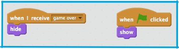
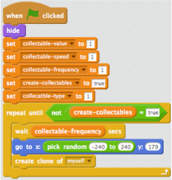
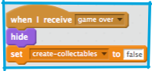

1. You may have noticed that the “lose” more block  on the “Player Character” sprite is empty. You’re going to fill this in and setup all the pieces needed for a nice “Game Over” screen.

First, complete the “lose” block: 

 * Stop the physics and other game scripts on the Player Character
 * Tell all the other sprites that the game is over, by broadcasting a message so they can change based on that
 * Move the Player Character to the centre of the screen and have them tell the player the game is over

2. Now you need to make sure all the sprites know what to do when the game is over, and how to reset themselves when the player starts a new game. Don’t forget that any new sprites you add may need code for this too!

 Start with the easy ones, the “Platforms” and “Edges” sprites both need code for appearing when the game starts and disappearing at game over. 

3. Now, for something a little more tricky! If you look at the code for the “Collectable” sprite, you’ll see it works by cloning itself. That is, it makes copies of itself, which follow the special when I start as a clone instructions. 

 We’ll talk more about what makes clones special when we get to the card about making new and different collectables, but for now what you need to know is that clones can do almost everything a normal sprite can, including receiving broadcast messages.

 Let’s look at how the “Collectable” sprite works: 

 * Make the original collectable invisible
 * Setup the control variables. We’ll come back to these later.
 * The “create-collectables” variable is the on/off switch for cloning
 * The loop creates clones if “create-collectables” is true, and does nothing if it’s not

4. Now what you need to do is setup a block like the ones you had on the “Edges” and “Platforms” sprites on the “Collectable” sprite. The only difference is you’re also setting the “create-collectables” variable to “false” so that no new clones are created. Notice how you can use the variable to pass messages from one part of your code to another! 