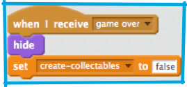

1. Pewnie zauważyłaś/-eś, że blok "przegrana" w skrypcie bohatera jest pusty. Zaraz go uzupełnisz i dodasz wszystkie potrzebne bloki aby stworzyć infromację o końcu gry.

   Najpierw, uzupełnij blok "przegrana":   

   * Zatrzymaj fizykę i wszystkie inne skrypty Bohatera
   * Powiedz wszystkim innym duszkom o końcu gry poprzez **nadanie komunikatu**
   * Przesuń Bohatera na środek ekranu i spraw by powiedział graczowi, że gra się skończyła

2. Now you need to make sure all the sprites know what to do when the game is over, and how to reset themselves when the player starts a new game. **Don’t forget that any new sprites you add may need code for this too!**

   Start with the easy ones, the “Platforms” and “Edges” sprites both need code for appearing when the game starts and disappearing at game over. 

3. Now, for something a little more tricky! If you look at the code for the “Collectable” sprite, you’ll see it works by **cloning** itself. That is, it makes copies of itself, which follow the special `when I start as a clone` instructions.

   We’ll talk more about what makes clones special when we get to the card about making new and different collectables, but for now what you need to know is that clones can do _almost_ everything a normal sprite can, including receiving `broadcast` messages.

   Let’s look at how the “Collectable” sprite works: 

   * First it makes the original collectable invisible
   * Then it sets up the control variables. We’ll come back to these later.
   * The `create-collectables` variable is the on/off switch for cloning: the loop creates clones if `create-collectables` is `true`, and does nothing if it’s not

4. Now what you need to do is setup a block like the ones you had on the “Edges” and “Platforms” sprites on the “Collectable” sprite. The only difference is you’re also setting the `create-collectables` variable to `false` so that no new clones are created. Notice how you can use the variable to pass messages from one part of your code to another! 

