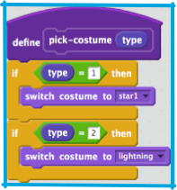
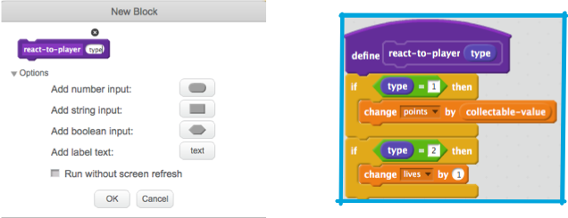

1. W projekcie, nad którym pracujesz znajduje się już rzecz do zbierania. Jest to gwiazdka. Jeśli się ją weźmie, dostaje się 1 punkt. To trochę nudne..

   Z pomocą tej karty stworzysz nowy typ rzeczy do zbierania przez gracza i zrobisz to w taki sposób, który sprawi, że dodawanie innych rzeczy będzie prostsze tak abyś w przyszłości mógł dodawać swoje power upy i bonusy.

2. Dodaj nowy kostium do "Zbierane\_rzeczy", który będzie reprezentował nowego power upa. Mi podoba się błyskawica ale Ty możesz wybrać co tylko Ci się podoba.

3. Zauważ, że już umieściłem kilka bloków tak aby ułatwić Ci pracę. W projekcie znajdziesz już "rzecz-typ" i zdefiniowany blok "wybierz\_kostium". Twoim zadaniem będzie udoskonalenie skryptu.

   

4. "rzecz-typ" jest **przekazywana** do "wybierz\_kostium" kiedy jest **wywoływana**, staje się zmienną "typ" i może być użyta wewnątrz **"Więcej bloków" **

5. Najpierw musisz ustawić typ rzeczy do zbierania. To po prostu liczba, którą używamy aby powiedzieć programowi, który kostium, jakie zasady, itp. powinien zastosować dla rzeczy do zbierania. Będziesz chciał aby liczba była wybierana losowo aby było ciekawiej. Poniższy przykład ustawia szansę na 1/50: 

   **Pro Tip!**

   There can be a different value set as the `collectable-type` for each clone. Think of it like creating a new copy of the variable on the main “collectable” sprite with the value that was in `collectable-type` the instant that clone was created. One of the things that makes clones special is that they cannot change the values of any variables they start with. They are effectively **constant** values.

6. Great! Now you’re setting a different value for the collectable type, but none of the code knows what to do with it yet!

   First, just teach the `pick-costume` **more block** to set the new costume when it gets the new type, like this \(using whatever costume you picked\): 

7. Now you need to decide what the powerup will do. We’ll start with something simple: giving the player a new life. On the next card, you’ll make it do something cooler.

   To create the powerup code, go into **more blocks** and **Make a Block**. Expand the **Options** section and add a **number input**. Name the block `react-to-player` and the number input `type`. Make the `react-to-player` block either give the same points prize that the star is already giving, or increase the player’s lives, depending on the `type` of powerup.  

   Update the `when I start as a clone` code to replace the points increase with a **call** to `react-to-player`, **passing** `collectable-type`. Stars still boost points but the new powerup adds lives. 

