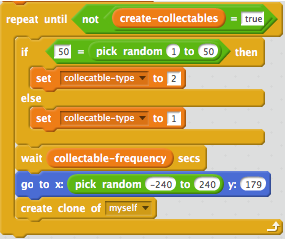

1. Now that you have a new powerup working, it’s time to make it do something cool! How about making it rain powerups for a few seconds, instead of just giving out an extra life? 
 
 To make that work, you need to create another piece of code that you can start while the “react-to-player” block finishes running. The way to make this happen is to use the `broadcast` block to send a message to another piece of code inside this sprite. Let’s call it “collectable-rain”, since that’s basically what it does!

2. Create this block on the “collectable” sprite. 

 This block just sets `collectable-frequency` to a very small number \(change it to different values, see what happens!\) and then waits a second and changes it back to `1`.

 This doesn’t look like it should do much, but if you think about what’s happening during that second, the `when (green flag) clicked` code is still running, and the `repeat until` loop in it is looping. Look at the code in that loop: 

  * Instead of pausing the code here for a second, it’s only pausing for _one millionth_ of a second, meaning that the loop will run many more times than normal because of the smaller value of `collectable-frequency`. 
   
   This means that the code is going to create _a lot_ more powerups in that second than it normally would.

   Can you think of any problems that might cause? There’ll be a lot more lightning bolts… what if I kept catching them?

3. Now you have that broadcast block ready, but it’s not being used yet. This next part’s easy. Just update `react-to-player` to look like this, so it broadcasts `collectable-rain` when the player touches a type `2` powerup. 

4. **Get Creative!**
 Based on this card and the previous one, you can now make as many powerups as you want! 

 What about one that gives out 20 times the usual number of points, adds three lives, or maybe means the player can’t run out of lives while it’s on?

 Come up with some and see if you can make them!