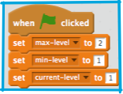
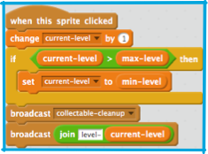
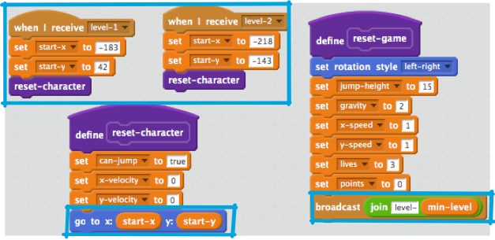

1. What you’re going to do on this card is add a new level to the game that the player can get to just by pressing a button. Later, you can change it so they need a certain number of points, or something else, to get there.

2. First, create a new button sprite by either adding it from the library or drawing your own. I did a bit of both and came up with this: 

3. Now, the code for this button is kinda clever; it’s designed so that every time you click it, it will take you to the next level, how ever many levels there are.

 Add this to your button sprite 

 
 These all need to be set by the programmer, so if you add a third level, don’t forget to change `max-level`!
 * `max-level` is the highest level
 * `min-level` is the lowest level
 * `current-level` is the level the player is on right now

 
 This uses broadcasts to tell the other sprites which level to display, and to clear up the collectables.

4. Now you need to get the other sprites to respond to those broadcasts! Start with the easy one: clearing all the collectables. If you just tell them to `hide`, all the existing clones will. So add this to the “collectable” sprite: 

 Since one of the first things any new clone already does is show itself, that means you don’t even have to worry about turning this off for them!

5. Now to switch the “platforms” sprite! You can design your own new level later, if you like, but for now let’s use the one I’ve already included \(you’ll see why on the next card!\).

 You just need this code to take the messages sent out by **joining** the `level-` and the `current-level` variable and use them to change the “platforms” costume. 

 6. For the “Enemy” sprite, you just need to make sure it disappears on level 2 \(or move it to another platform!\), like this: 

 7. Finally, the player character needs to separate out the coordinates from the `reset character` **more block**, so the character goes to the right place, and call the first level when the game starts. 
 Notice the highlighted blocks. Here's what they do:
 * Set starting coordinates and **call** `reset-character`
 * Use variable starting coordinates instead of fixed **x** and **y** cordinates
 * Use the broadcast of the `min-level` to reset the character and game

 
