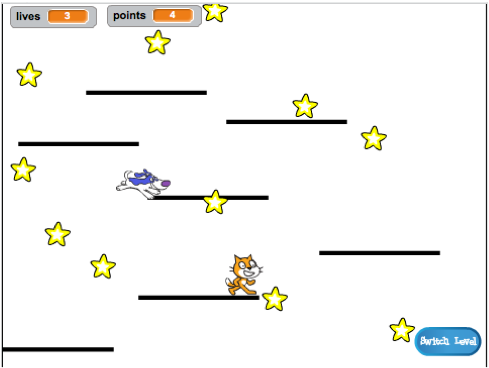

1. To są karty Sushi z zadaniem na zaawansowanym poziomie Scratcha. Pracując z nimi będziesz tworzyć grę platformową, do której będziesz mógł dodawać swoje poziomy, power-upy i bohaterów.

   

2. Ponieważ uczysz się Scratcha a nie jak zbudować silnik oparty na fizyce \(kod, który sprawia, że rzeczy "zachowują się" jak w rzeczywistości, np. nie  przelatują przez ściany czy podłogi\), zaczniesz projekt kopiując gotowy skrypt, który zawiera podstawowe ruchy, skakanie i wykrywanie platform.

   Spójrz na ten skrypt gdyż później będziesz dokonywał w nich zmian jednak nie musisz rozumieć wszystkiego co skrypt wykonuje.

3. Pierwszym krokiem jest skopiowanie skryptu z projektu [dojo.soy/advanced-scratch](http://dojo.soy/advanced-scratch).

   Możesz pobrać ten skrypt klikając "Zajrzyj do środka", następnie **Plik **w pasku zadań, wybierz "Pobierz na swój komputer", a na końcu otwórz ten projekt na swoim komputerze.

   Możesz użyć projekt bezpośrednio w swojej przeglądarce klikając "Zajrzyj do środka", a następnie "Remiks".

4. Silnik fizyki gry składa się z różnorodnych części. Niektóre z nich już działają na tym etapie, a niektóre nie. Działanie skryptów możesz sprawdzić uruchamiając grę i próbując w nią zagrać.

   Możesz tracić życia ale nic się nie dzieje jeśli stracisz je wszystkie. Ponadto, gra ma tylko jeden poziom, jeden typ rzeczy, które można zebrać i nie ma przeciwników. Naprawisz to wszystko i zrobisz jeszcze więcej!

   For now, take a look at how the code is put together. It uses lots of **more blocks**, which are great for splitting your code up into pieces so you can manage it better. It’s like having a block made up of a lot of other blocks, which you can give some basic instructions to.

   

   * The main game `forever` loop calls the `main-physics` block to do a whole lot of stuff! Keeping them separated like this makes it easy to read the main loop and understand what happens when, without worrying about _how_ it happens.

5. Now look at `reset game` and `reset character` and notice:

   * They do pretty normal things—setting up variables, making sure the character rotates properly
   * `reset-game` **calls** `reset-character`—you can use a **more block** inside another **more block**!
   * `reset-character` gets used in two different places, but to change it you only have to change the code of the **more block** in one! This can save you a lot of work and help you avoid mistakes.

